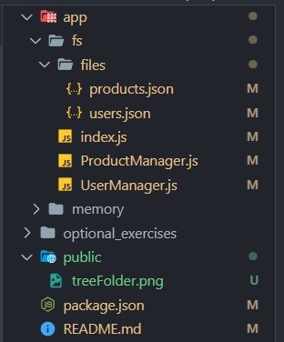

# Projecto creado para la comisión de CoderHouse 55655

## Como ejecutar el código

Debemos en una consola ingresar el siguiente código para que nos de la lista de scripts que podemos correr
```bash
npm run
``` 


## sprint 1

Se creo 3 archivos
- ProductManager
- UserManager
- index

Además, en cada uno de los Manager se creo las siguientes funciones
- Read: trae todas las entradas
- ReadOne: Trae una entrada basado en el ID
- Create: Crea una entrada


## sprint2

Se cambio la estructura de archivos


>[!NOTE]
>Cabe aclarar que la carpeta public fue creada solo para guardar las imagenes que se muestran en el README

Dentro de la actual carpeta llamada `fs` se adapto el código para el uso del nuevo módulo

```javascript
import fs from "fs"
```

Además de esto se creo una carpeta llamada `files` donde se van a guardar de forma dinamica las nuevas entradas de los archivos `ProductManager` y `UserManager`

