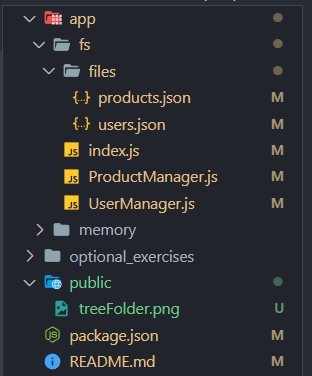
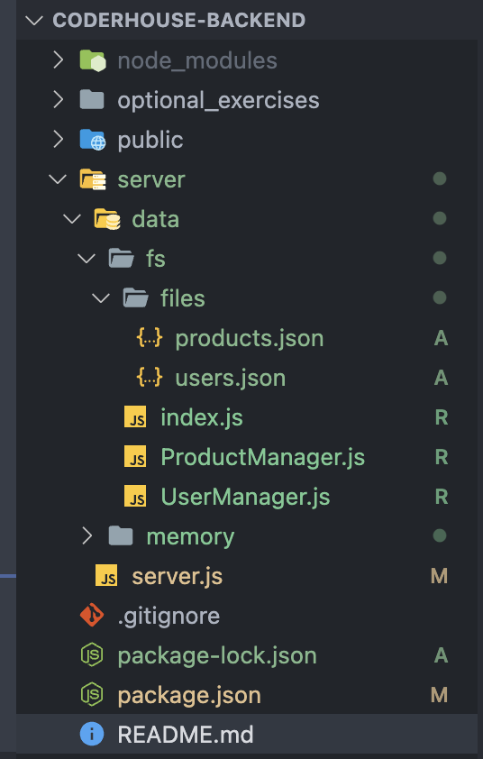
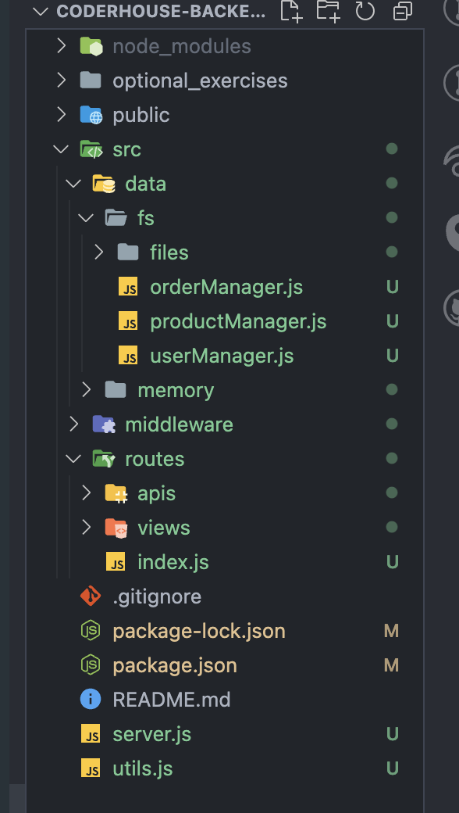

# Projecto creado para la comisión de CoderHouse 55655

## Como ejecutar el código

Primero debemos instalar las dependencias del proyecto
```bash
npm install
```

Debemos en una consola ingresar el siguiente código para que nos de la lista de scripts que podemos correr
```bash
npm run
``` 


## sprint 1

Se creo 3 archivos
- ProductManager
- UserManager
- index

Además, en cada uno de los Manager se creo las siguientes funciones
- Read: trae todas las entradas
- ReadOne: Trae una entrada basado en el ID
- Create: Crea una entrada


## sprint2

Se cambio la estructura de archivos



>[!NOTE]
>Cabe aclarar que la carpeta public fue creada solo para guardar las imagenes que se muestran en el README

Dentro de la actual carpeta llamada `fs` se adapto el código para el uso del nuevo módulo

```javascript
import fs from "fs"
```

Además de esto se creo una carpeta llamada `files` donde se van a guardar de forma dinamica las nuevas entradas de los archivos `ProductManager` y `UserManager`

## sprint3

Se cambio la estructura de archivos 



Se agrego las siguientes dependencias:

```bash
npm install -d nodemon
npm install express
```

Se agrego los siguientes módulos:

Express para la creación del server, que se puede encontrar en el archivo `server.js`
```javascript
import express from "express"
```

Luego URL para las rutas relativas de forma dinamica
```javascript
import { fileURLToPath } from 'url'
```

Por ultimo se agrego Crypto para la creación de las ID de los productos y users de forma aleatoría
```javascript
import crypto from "crypto"
```

Sumado a esto tanto para `ProductManager` y `UserManager` se agrego la función `Destroy` para la eliminación de un registro

Se crearón los Endpoints del server los cuales son:

- /api/products
- /api/products/:pid
- /api/users
- /api/users/:uid

En caso de querer hacer pruebas y cambios teniendo un hot-reload hay que correr el servidor con `npm run dev` en caso contrarío de querer correrlo para productivo correr `npm run start`


## challange1

Se agregarón las siguientes dependencias:

- multen
- morgan

Se cambio la estructura del código para trabajar con express


Se creo un nuevo manager que es el de `Orders` con los métodos:

- create
- read
- readByUser
- update
- destroy

y tambien la respectiva api con los endpoints:

- POST /api/orders
- GET /api/orders/:uid
- GET /api/orders/:oid

Tambien se agregarón nuevos endpoints:

- DELETE /api/products/:pid
- PUT /api/products/:pid 

Se agregarón nuevos middlewares:

- errorHandler
- orderHandler
- pathHandler
- productHandler
- userHandler

Se agrego un nuevo js llamado `utils` el cual ayuda a traer el `__dirname` y tambien tiene los métodos de lectura de archivo, los cuales antes se encontraban en los manager, esto se hizo para no tener tanto código repetido y de fácil acceso

## sprint 4

Nuevas dependencias agregadas:

- socket.io
- express-handlebars

Se creo el websocket con el servidor para poder tener una comunicación entre front y back, además de eso se crearón los handlebars:
- form (/form)
- index (/)
- real (/real)
- register (/register)
- main (Layout)

Se creo tambien el Router de Views para que haga uso de los handlebars.


